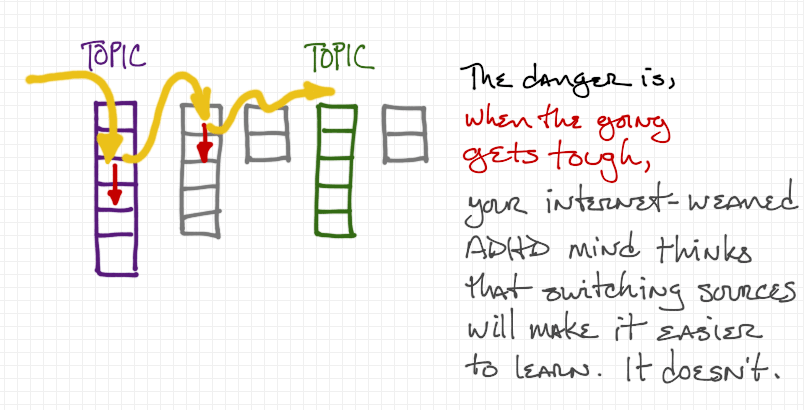

# Introduction

We're interested in taking what we know given our experience in other languages (like Python and Java) and quickly coming up to speed on JavaScript. 

We're operating under a somewhat contrived but not too unrealistic assumption that we have two weeks to implement something useful in a new language. We don't have time to read a bunch of books or go through a complete set of tutorials.

The method we're going to use is to _search and skim_ a limited number of sources, reading with what we find with two questions constantly in our minds:

In all this new stuff I'm reading, 
1. What's the same as I already know?
2. What's different that I have to watch out for?

-------
# Sources

There are too many sources of information about JavaScript. Many of them are excellent.

With all these sources, we can easily get trapped in _searching_ instead of _studying_. When something we're reading isn't clear or we aren't understanding _as quickly as we expected to_, the temptation we all run into is look for something easier to understand. We go to a second source, read until we're confused, and then search again. Each time, we get to the same depth and move on. We never stick with a source when the going gets tough, and we never invest in learning.



Instead, we need to restrict ourselves to a limited number of _trusted_ sources. Sure, we can switch to a different source when one isn't working, but we keep coming back so we can become familiar with them, going deeper and getting further every time.

For JavaScript, we’ll confine ourselves to these three:

* Mozilla Developer Network
* __Eloquent JavaScript__, 2nd edition, online version
* W3Schools

If you know of better, equally comprehensive sources, add them to the list. But keep the list small.

## MDN - The Mozilla Developer Network

MDN has a wide variety of information from basic to advanced and is kept up to date. It’s worth your time to become very familiar with it.

It has a mix of begineer and expert information. It is well-suited to learning when you are more than a beginner but new to a particular topic. For example, this page is a nice, quick overview for somebody who's comfortable with the way other languages do things.

https://developer.mozilla.org/en-US/docs/Web/JavaScript/A_re-introduction_to_JavaScript

It gets pretty detailed towards the end, but the early bits are fun and easy.

## __Eloquent JavaScript__

__Eloquent JavaScript__ is a book -- a well-written, well-reasoned tour of JavaScript. It's not too old, but the principles it tries to get across still apply.
However, I don't recommend reading it word-for-word, front to back when you're trying to learn JavScript as your third language. You already know a lot of the basics that are carefully presented in this book.

## W3Schools

Finally, there's always w3schools (https://www.w3schools.com/js/default.asp) for quick & dirty introductions to JS topics. Just the facts, often in tables or bulleted lists, with none of the context and nuance of __Eloquent JavaScript__ or the depth of MDN. Also, it's not as up to date as MDN.

-------
# Searching trusted sites

How do we search just the sites you trust to find information? If you just "google" something, you get lots of noise - stuff that looks useful but is unfamiliar or worse: unreliable. It would be better to keep going back to the same, trusted sites to find what we're looking for. 

A useful technique is to search within a particular site using google. Include a `site:URL` parameter (where URL is the site you want to search) in your search string.

As our first example, let's say somebody tells you, "Always use the `===` operator." But you don't know what that operator is. You haven't seen it before. Let's use Google to find out about that thing, but only use the sites we want to become familiar with. In our search string, we're going to quote the string so Google won't mess with it.

First, let's check w3schools.

Type this search string into www.google.com:
```
site:https://www.w3schools.com/ "==="
```
The [first hit](https://www.w3schools.com/jsref/jsref_operators.asp) here is a reference table of operators. Perfect. Simple and to the point. Unfortunately, it's on page littered with ads, but that's w3Schools. Searching on the page or scrolling down finds the entry, "equal value and equal type". Not sure what that means. Maybe we can find more information at another site.

Now try this string at www.google.com:
```
site:https://developer.mozilla.org/ "==="
```

The [first hit](https://developer.mozilla.org/en-US/docs/Web/JavaScript/Equality_comparisons_and_sameness) takes you to MDN, where you'll find an in-depth article on "Equality comparisons" and lots of useable info. But this page will be most useful _if_ you do two things:
1. **Skim.** When you hit something you don't understand, skip to the next paragraph or list item. This avoids losing your train of thought and getting derailed.
2. **As you read, recall as much as you can about the topic from what you already know.** (In this case, it's equality and boolean expressions in Python and Java.) This will give your mind "hooks" to hang the new information on as you learn it, leading to deeper learning that can be applied more readily.

So, the first list on the page, "There are four equality algorithms in ES2015:" frankly goes too deep, too fast. So I skip to the next one. This one is better, starting with "JavaScript provides three different value-comparison operations...." This looks familar to what I know about Python and Java. 

Skimming down the page I see a whole subsection on the operator, titled, "Strict equality using ===". I spend some quality time with that section. Apparently, JavaScript is dynamically typed (like Python) but allows you to check that both the type and the value match (like you can in Java) _if_ you use this operator. The operator we're familiar with, `==`, isn't enough and can lead to trouble.

But as I read MDN, it's clear that there's a lot of assumed, tacit knowledge about JS that's needed to really get the most out of this resource. When I learn more about JS and come back to this page, I know I'll get more out ouf it. But for now, what if I need a gentler introduction and some context? That's where __Eloquent JavaScript__ comes in.

Finally, use this search string

```
site:http://eloquentjavascript.net/ "==="
```

The [first hit](http://eloquentjavascript.net/01_values.html) takes us to the first chapter of __Eloquent JavaScript__, a nicely written chapter on introduces numbers, types, operators and all sorts of other stuff.  Fun to read if you have the time and it doesn't assume that you know too much stuff. Excellent for beginners. (Or for when you might want to climb into a hot bubble bath, light some candles, put on some music, and spend some _quality_ time with JavaScript. Aw yeah, baby....)


-------
# Example: What JS data structure handles name-value pairs?

Let's try using this "search and skiim" approach when you want to learn something specific about JavaScript that you already know from Python or Java. Let's see where it leads.

So, there’s got to be a way to store name-value pairs in some sort of data structure, right? It’s a reasonable assumption. In Python, these were called “dictionaries” and we used “HashMaps” in Java. What are they in JavaScript?

## Let’s start with w3schools
Search Google using the query:
```
site:http://www.w3schools.com/ javascript name value pair
```
Note that we're _not_ quoting any strings 1) because they are simple words and 2) we'll get more results this way. We're also including the term "javascript" in our search because w3schools.com has other subjects and languages.

The [first hit](https://www.w3schools.com/js/js_objects.asp) is a tutorial, and the second is more of a reference. I take a look at the tutorial and it seems too lightweight. I'm in a hurry, so I'm avoiding tutorials for the moment. So I keep looking. 

The [second hit](https://www.w3schools.com/js/js_object_definition.asp) look like it has more info. It has a short description of something called “objects” that mentions, "A JavaScript object is a collection of named values” 

I was expecting a "hash" or a "dictionary" but this sort of name-value pair data structure is apparently called an "object" in JavaScript. Um, ok. Seems overblown, coming from the complexity of Java classes and objects. But, we know from Python and Java that objects are a big deal. So, it’s likely that these JavaScript data structures are used for more than just storing sets of simple variables. Reading down the page, that impression grows. There’s a lot of stuff about creating and using "object" data structures that looks familiar. It’s presented in short bullet lists without a lot of detail. Clearly, there's more to name-value pairs than I expected!

## Let’s check this against our other main source, MDN.
Search Google using the query:
```
site:https://developer.mozilla.org/ javascript "name value pair"
```
Notice how I'm quoting the phrase "name value pair". Try it without the quotes and you'll get _too many_ results. Apparently,  the words "name" and "value" appear all over MDN, mostly in reference documents, and the results are just too noisy. So, I look for the phrase that I'm familiar with, "name value pair," hoping that it gets me something I can use for my current level of understanding.

The [first hit](https://developer.mozilla.org/en-US/docs/Learn/JavaScript/Objects/Basics) takes me to an article on "JavaScript object basics”. This one’s in the middle of a tutorial but I don't want to start from the beginning so I’ll just skim this article. It’s nice to know I can go back to the tutorial if I need to.

A short read, but, yep, clearly there’s a lot more to name-value pairs in JavaScript, especially when the values are functions. 

### Let’s check in with ____Eloquent JavaScript____

But, perhaps this quick approach isn’t giving me the context I need. Perhaps I need something that takes its time and explains things in depth:

Search Google using the query:
```
site:http://eloquentjavascript.net/ javascript name value pair
```

The [first hit](http://eloquentjavascript.net/04_data.html) is a nice chapter on “Data Structures: Objects and Arrays”. It walks through a number of foundational and precursor concepts (sets, arrays, indexing, delimiters, properties and methods) before getting to objects.

Notice that this is the same information we saw at MDN but presented in a different way. Maybe this way works better for you today, on this subject. It also uses a common textbook technique of a running example which shows some nice applications of the data structure. A good approach for learning, but time consuming. 

I skim it quickly, but it has too much information I already know and it's all in paragraphs, not lists. Hard to skim. I’ll probably come back when I get stuck. 

By this time (about 15 minutes in) here’s what I know:

1. In JS, name-value pairs are stored in “objects”. This seemed like just a dictionary at first, but the way everybody immediately starts using these data structures like python and Java objects, (putting functions in there, among other things, using dot notation, etc.) makes it seem like there’s more to  it than a simple HashMap. As w3schools puts it, "In JavaScript, objects are king. If you understand objects, you understand JavaScript."
2. Both w3schools and MDN have reference material _and_ tutorials, so I can get two perspectives on things. I'll be coming back to both places as I use objects (because I know from Python and Java that I'll be using objects all the time).
3. There's a lot of stuff that goes in to making this work and if I get lost or confused, I can spend some quality time with ____Eloquent JavaScript____ to get the whole picture.

-------
# Summary

* Pick a small set of trusted sources
* Include sources with a variety of writing styles: simple bullet lists, in-depth reference material, textbooks, etc.
* Include sources that are targeting a range of experience: beginner, moderate, expert
* Keep the set small
* Focus your searching on just these sources using site-specific Google searches
* When a topic is hard to understand on one source, switch to another
* Resist the urge to find new sources when the learning gets difficult
* Skim relentlessly but return to the same pages of the same sources
* As you read, ask yourself, "What do I already know about this subject? How is JavaScript the same"
* But be careful to not make assumptions. Ask yourself, "What is different about JavaScript compared to other languages?" 

--------
# Exercises
Use the three sources above to answer the following questions. 

For each question, time-box your effort: set a timer to 15 minutes and see how much you can discover by quickly skimming the three sources. You won't become an expert, but you _will_ learn enough to have an introductory idea of what's going on. That's good enough for now.
1. How do you iterate over an object in JavaScript? Try searching for "iterate" or "iteration". How does this differ from Python?
1. What is a JavaScript "prototype"? How is it related to the idea of "class" in other languages? How is it different?
2. JavaScript and Python are both dynamically typed languages. But, what is a JavaScript "number"? How is storing numerical values different between JS and Python? How are they the same?