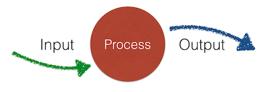
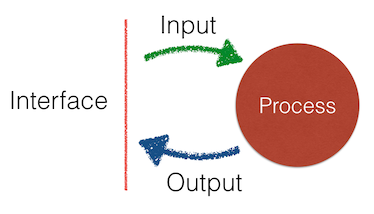

*There are a lot of opinions in this article. For example, people ask me, is "RMCP" a real named thing in computer science? Nope. This is simply good design technique established while developing software over decades and while conducting hundreds of technical interviews. As for the name... I just like Mounties (The "RCMP"). [Note 1]*


This is a structured method for creating functions or methods (I'll use those terms interchangably). It's useful during program development, but it also could be used in a technical interview to quickly white board up a solution to a problem. Our theme is: "Design Before Doing." Otherwise known as “Don’t code yet!"

This method helps to make sure that you cover all aspects of function design. It depends on the idea that you can completely describe any function in terms of "input-process-output."



1. First consider the **inputs**: What type, format, domain are expected? How many are required or optional? 

1. Next, nail down the **outputs**, their format and range of values.

1. Finally, develop the function's **process** in a top-down fashion, using the princple of "write the code you wish you had."

By focusing on the inputs and outputs first, you define the function's *interface*, its contract with the rest of the system.

 

This method fosters a design conversation between designer for the function and the customer of the function, whether that's the designers of other functions in the system *or* a techincal interviewer.

## Using this method to win at interview whiteboarding

You can use this method during technical inteviews.

Let's say somebody says to you, "Give me a function that takes string and then finds all the words in that string containing the given character."

This is your requirement spec. You can see the IPO model immediately:

1. What are the inputs? (A string of words and a character)

1. What are the outputs? (A string of words)

1. What is the process? (Some sort of search that examines each word)

But it's not yet detailed enough to write code. For instance, what should the function do:

...to report errors?

...if the character isn't found?

...if the inputs are bad (empty, missing, or not strings at all )?

...if the input is huge?

...if the character set is not ASCII?
 
So, use this RMCP process to ask questions until you are sure of the requirement details. (This is actually called requirement elicitation and is a common process on a development team.) Use this checklist to make sure you know what you're doing before you do it. Use it to organize your thinking and demonstrate that you have an rigorous approach to design.


# Step one: The Gazinta - What are the inputs?

The first step focuses on the inputs - the material the function needs to deal with.

1. **Type**: What are the types of the values?

1. **Domain**: What variety of values can we expect? Positive integers? All real numbers? The strings of any length? Any particular character set?

1. **Cardinality**: How many inputs are there? If there are several, are they aggregated in a collection like a tuple or array? 

1. **Value/Reference**: Are the inputs passed by value or by reference? If by reference, are they intended to be modified or not?

1. **External/internal**: Which of the inputs are provided as parameters? Which are part of the class (of which this method is a member)? Are there any inputs coming from somewhere else?

1. **Optionality**: Are any of the inputs optional?

1. **Legality**: Are there any known illegal or false values that we know will arise? Some times this is known as “noisy” data, where some or many of the inputs need to be filtered out or ignored.

1. **Uniformity**: Are there some values that require special processing (sometimes called “edge cases" or "corner cases”)? For example, if the input is a range of both positive and negative integers, zero is often a special case, especially if that input is going to be used as a divisor.

In white boarding, when there's a lot going on and it's hard to remember long lists, it’s important to get the first few (Type, Domain, Cardinality). The latter ones are less likely to be critical to answering the question and having a good time with the interview.

In system development, be sure to go through the entire list.

In test-driven development, once you know what the function should expect to recieve, start to think about what should happen if some other function supplies the wrong thing in any of these many dimensions.

# Step Two: The Gozouta - What are the outputs?

The second step focuses on output. Not necessariy their values, but their types, formats, and delivery method.

1. **Type**: What type of values should be returned? What data structure should be used? What object class?

1. **Range**: What range of values are expected? Only negative whole numbers?

1. **Error reporting**:  are there values within the designated type and expected range of output that can be used indicate indicate errors, or do we need to use exceptions?

1. **Side effects**: Are there any outputs of that aren’t in the return value? Does the function modify the Document Object Model, for example. Note: Don’t design in side effects if you don’t need to. Always return results.

1. **Modified parameters**: Is the routine supposed to modify some parameter that was passed by reference?

1. **Format**: Is there a particular format or template to be used?


# Step Three: Test cases are now available

At this point, when white boarding, you should write down a small set of sample inputs, each with their expected output. For simple functions, your massive human brain can probably derive the outputs from the inputs by inspection. In more complicated algorthims, you may have to know more about the process used in the function (which we discuss later). Write down what you can.

Pay special attention to include the error, edge, and corner cases. Verify the correctness of your sample with your interviewer. Call the sample set, “our test cases.”

At this point in test-driven design, you’ve got all the possible test cases. Write them down as comments or “on-hold” tests. Later, when you’re ready to start coding, you can enable them one by one and code to the test.

# Step Four: The guts - Top down process design

Now it’s time to write down your routine’s pseudocode. In interview situations, this is where everybody starts writing for loops in broken syntax and gets lost. Instead, follow some top-down steps and avoid getting too detailed too early.

## Strategy first

Think in general terms about strategy first.

1. Am I going to be iterating over a collection? Over more than one collection?

1. Am I going to be calculating the result all in one go, or am I going to be accumulating the result as I work through things?

1. What sort of intermediate results am I going to have to keep track of?

1. Is the data I’ve been given in the most efficient form possible, or would it be better if I reformat the data for easier processing? For example, if I’m looking through an array, would it be better if I sorted it first?

1. If I run into an error condition, what’s my exit strategy? Do I bail right away or do I have more to do before I return? Should the routine have several exit points or just one? Are there values should be accumulating as I go?

## Verb phrases

Next, **write down pseudocode, using verb phrases**. You don’t need to do this in order. You can start with the most important steps first, or the tricky steps first. Then you can fill in the steps needed to prepare for those the ones you’ve written. 

For example, let’s say you are given an array of integers and you have to return an array of the integers that are “missing." The heart of your process is a step like, “loop through the whole array and if we discover there’s a missing value, put that value in the result array.” Sure, at this point you don’t know how you’re going to "discover there’s a missing value” yet, but you know this looping step is going to be required.

## The happy path

**Write pseudocode for “the happy path” first.** This is where everything is ready, everything works, and there are no errors. This shouldn't be very hard because, well, when we're starting out, most of us *only* consider the happy path.

## Write the code you want: descriptive function names

**Some of these pseudocode verb phrases can be immediately converted into function calls** by putting hyphens between the words and adding some trailing parenthesis.

Example:

1. “compare current value with target” becomes "compare-current-value-with-target()”

1. Then, depending on the language you’re using, it might later become “compare(current_value, target)” or “current_value.compare(target)” or who knows what - that comes later.

Sometimes you’ll see this called, **“write the code you wish you had”** which means, **assume there’s a function somewhere that does what you want**. Maybe you’ll end up writing it, maybe you’ll find it in the standard library or some package, maybe you’ll find some open source software that does what you need.

## Test your pseudocode

Use your test cases and sample input/output data to check your pseudocode. When designing by yourself, take a few moments before diving into the code to think about your approach to the problem. Save yourself some time.

When whiteboarding, say it out loud as you walk through the code. In some cases, the interviewer may even stop you there once she see’s you’ve got a good handle on things.

## From algorithms to data structures

Think about your internal temporary variables and data structures. 

1. What’s the best way to store stuff while you’re working on the problem? 

1. Are there objects already defined that can help? 

1. Are some kinds of data structures better for this case than others? For example, can you index into an array or should you index with a key into a hash?

1. Do the parts of your data structures have names?

1. Are your data structures and function calls parts of some sort of object?

## Fill in the functions

**Write code using function calls**. Write the code you wish you had. Even simple steps like assignment statements might benefit from a function call if you aren't exactly sure where the value is coming from.

```aVariable = calculateTheCorrectValue()```

**Recursively define the function contents**. For each function, look inside and define how it works. Use the same approach as you did to the main function, writing pseudocode and the functions you wish you had. 

Interview algorthims rarely require many nestedfunctions, but real world systems may have functions that call functions that call functions that...

## Make sure it's readable

**Refactor the simple functions into in-line code**. It's perfectly fine to turn a complicated statement (especially regexs) into a well-named function. But some times, the few lines in the function are clear and self-explanatory. They don't need to be summarized and abstracted into a function call. That is, unless the code will be reused several places. Then the function is always better than copy-paste.

# Whiteboarding checklist

When you’re using the process in a interview/whiteboarding situation, simplify. Inputs, outputs, psuedocode, functions, data structures.

1. **Set up your work area**. Find some markers that work. Find an eraser. Break your available whiteboard space into three areas: *Code* (the biggest area), *Notes*, and *Tests*. Write small. If you are doing a screensharing session, open a file in the text editor and create a block comment. Put the *Notes* and *Tests* headings in the block. Your code will start below the comment.

1. **Write down the problem**. Yes, actually write it down in the *Notes* area. Don’t assume you’ll remember it. Use this as a time to get used to writing on the whiteboard.

1. Ask about the **inputs**. Write down a list of the answers. Write down example inputs in the *Tests* areas.

1. Ask about the **outputs**. Write down a list of the answers. Match the inputs in the *Tests* area with their resulting outputs

1. Ask about the **process**. Write down the process as a one liner of pseudocode. Make it a single line comment in the *Code* area. Think about the Single Responsibility Principle and make sure your method only does what is required, nothing more. If the question

1. **Write the tests**, That is, write down any other sample inputs and outputs you can think of in the *Tests* corner of the board. If you are in a screen-sharing session, put them in the main block of comments.

1. Write **the method signature** up at the top of the Code area as needed. Make sure the method name matches your understanding.

1. Write down **the return statement** down at the bottom.

1. Under the method signature, start writing down the names of your **internal variables**. Write them as phrases, then add dashes inbetween the words. Don’t try to write syntax.

1. **Leave some space** for more variables, later.

1. As your first list of pseudocode, write “check inputs and return any errors”

1. **Write the process steps as psuedocode**. At the whiteboard, make sure your penmanship is readable. It's worth it to practice writing at a whiteboard if you can before the interview.

1. **Test your psuedocode** by taking some sample inputs and verbally stepping through your process to make sure you end up the the expected return value.

1. **Create function calls** recursively from the top down, using the syntax of your chosen language.

1. **Write statements** in correct syntax. If you're doing python, you might draw vertical helper lines at the current indentation level, then erase them. It's easy to write at crazy angles and wierd indents if you're thinking about something else.

# Test-Driven-Design Checklist

1. Create your test and app files using the appropriate naming conventions. Lean on your templates and snippets. If your IDE can generate test file skeltons, use it. Use the test file for your *Tests* area and the app file for your *Notes* and *Code* areas.

1. Thoroughly characterize the inputs using the entire list in *Step One*, above. Write down everything you know about your inputs in a comment block in your testing area.

1. Characterize the **outputs** and write that down in the test file. 

1. **Write down typical values** for both inputs and outputs. 

1. **Create fixtures or generators for data** but just add a few representative values at a time and add more as you write more tests. Don't write anything you don't immediately use. Or, said differently, write only what you need *right now*, for the next test.

1. **Write the first test for the happy path**. Give the routine easy-to-handle inputs that should result in a normal return values.

1. **Write the code to make the test pass**. 

    1. In the app file, match the method signature you used in your test
    1. Write only the code you need to make this particular scenario work
    1. Get the code working (and the test passing) as fast as possible. Keep it simple.

1. **Mock up external services**. As you develop your function, it may need to call external services. These may be other parts of your system or third-party systems. You don't want your tests to depend upon these services working correctly. In some case, you may not have built them yet. So you create *test doubles* of various sorts to stand in for them during your test. These are typically objects created in your test framework that have the same signature and interface as the service but they only return one or two expected values. This is a [complicated topic](https://blog.pragmatists.com/test-doubles-fakes-mocks-and-stubs-1a7491dfa3da) so do as little as possible and keep moving forward. While whiteboarding, identify external services and state you will either presume they work or mock them up as necessary.

1. **Add tests with more input parameter values**, updating your fixtures as necessary. Add a few across the entire domain of possible inputs that your method should be able to handle. These tests should pass (unless your algorithm needs revising).

1. **Add tests for illegal parameter values**, then write the code to handle them. This will define how your method reports errors. If it throws exceptions, this is the time to set them up. In some languages changing the signature to throw exceptions like this will require you to refactor your earlier tests to catch exceptions, even if thoses tests won't involve any error conditions. 

1. **(Language-specific)** **Add tests with the wrong number of or wrong type of parameters**, then write the code to make them pass. This abuse of your method signture may not be possible in your language, or your language may throw errors by itself. But in some languages you can pass the wrong number of parameters or the wrong type of parameters. Write one test for each variation of incorrect parameters, writing the necessary code for each one. This is where you can prevent many types of run-time errors, so don't skimp.

1. **Fearlessly refactor** and **lean on git**. Commit your code between tests. This, combined with the small set of regression tests you are creating, will allow you to change your code, adding functions, re-writing algorithms, doing the needful, without concern of breaking something. As they say, "move fast and break things." Be confident that your tests will tell you if you make a mistake. And, if things get too messed up, throw away your code, back up to the last commit, and quickly try again. Move fast.

1. **Focus on side effects**, which may require a different way of checking results. Your test code may need to mock up the external datastructures being modified.

1. **Focus on exception passing** Do any of the sub-functions or services your method uses throw exceptions? Will your method catch them or pass them along? How will you test to verify that this is working?

# Summary

There's a lot here to remember. Your best bet is to go back over the main input-process-output sequence and make your own checklist, then use it as you practice function design or practice your whiteboard technique.

----
## Note 1: On Mounties as role models

A venerable organization based on the principles of honor, bravery, and persistance, the Royal Canadian Mounted Police (RCMP) have been heroes of mine since childhood. However, their process of incorporating women into their ranks, started in 1974, has been problematical. It has unfortunate parallels to the tech industry.

The RCMP recently recognized that it suffered from a history where "... many women in uniform were sexually assaulted, physically assaulted, harassed, discriminated, and bullied." They are making changes and have set asside [$100M to address damages](http://dailyhive.com/montreal/rcmp-sexual-assault-compensation). I expect them to once again operate in accordance with their principles and rise to their best selves. They're Canadians after all, eh?

This is yet another example of an organization with the highest ideals and standards *still* having a problem doing the right thing while claiming to encourage gender diversity. For reasons I still don't understand, it's difficult to do this well. But with honor and persistance, it is possible.


